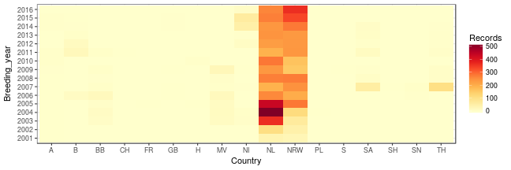
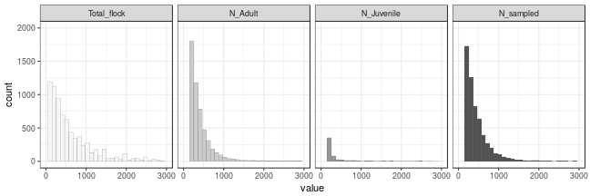

# Data fields

The data are provided as an Excel file, and have the following information in columns.

1. Temporal variables:
 - **Breeding year** The breeding season associated with the data, with winter months of a year *n* actually part of the winter of the year *n-1*.
 - **Day**, **Month**, **Year** Date of the record.

2. Spatial variables:
 - **Country** Administrative unit in which the record was made. For Germany, the data are resolved down to the state level, a list of abbreviations is provided.
 - **Region** Subdivision of the country. For German states, it isn't clear what this represents. Abbreviations not explained, appear standard and can be deciphered.
 - **Site name** Name of the site, likely to be important for spatially explicit analyses.
 - **Site code** Code given to a waterbird survey site. Not all sites have a code. If sites with codes lie more commonly within protected areas or some other landuse type, might be a useful way of subsetting.

3. Species variables:
 - **Euring** A code, here 1590, constant.
 - **Species** Greater Whitefronts. In some cases though Whitefronts are part of larger flocks, and a note of which the numerically dominant species was would have been interesting.
 
4. Sample information:
 - **Sample type** Of two types, *S* and *T*, where *S* represents single flock records, and *T* represents records collated across flocks.
 - **Sample no.** Some flocks were sampled more than once. Represents the sample number at a recorded flock.

5. Flock variables:
 - **Total flock** Total size of the recorded flock. Importantly, appears to include heterospecifics!
 - **N_adult** Number of adults in the sample.
 - **N_juvenile** Number of juveniles in the sample.
 - **N_sample** Nmber of Whitefronts in the sample.
 - **Perc_JV** Percentage of first winter geese.
 
6. Family variables:
 - **Fam1**...**Fam10** Number of families with *n* number of juveniles.
 - **Mean_Fam** The mean family size. Unclear whether this is a simple or weighted mean.

7. Other data:
 - **Food_type** The type of food on which geese were seen. An abbreviations table is provided.
 - **Observer** and **Remarks** Observer and notes, useful in case data have anomalies.


# Season and geography


## Breeding year

The data has records from 55 breeding years, from 1957 to 2011. From 1991, the number of records rises above 5, and from 2002, above 100. 
The plot below shows the relationship between month and year. 2001 and 2002 are relatively sparsely sampled, and the number of samples is low in April and September since there are few geese.


```
## Error in scale_fill_gradientn(): argument "colors" is missing, with no default
```


## Country


The records are from ``17`` countries, of which 8 are German states. Most records are from the Netherlands (~3300) and North-Rhine Westphalia (~2000). Records from other regions are not more than 150 each.





## Region


``78`` regions are represented. Of these ``24`` are in the Netherlands or North-Rhine Westphalia.
``2030`` unique sites were surveyed. Of these, ``1703`` are in the Netherlands or North-Rhine Westphalia.

This could prove an issue in case the analysis were to made spatially explicit, or if we wanted to check for time-position duplications, or near duplications.

# Sample information


The data have ``8764`` records. ``572`` records are second or higher samples. Flocks that were sampled more than once were sampled ``13`` unique times, ie, there are ``13`` values for the variable ```Sample_no```. These will have to be averaged out or discarded. The higher ```Sample_no``` values are ``NA, 2, 99, 3, 4, 5, 6, 7, 8, 9, 10, 11, 12``, which includes the improbable 99. There are also ``121`` ```NA``` values. There are also ``121`` type ```T``` samples. It appears that the ```T``` type samples' sample numbers have been left blank.

# Flock Size and Composition

## Summary table


``8764`` records are provided. The table below shows the number of **non-NA** records for each flock size variable, the first quartile, the median and the maximum value.


|                  | Records| Qrt1| Median| Maximum|
|:-----------------|-------:|----:|------:|-------:|
|Flock size        |    8116|  200|    425|   20000|
|Adults            |    8706|  104|    205|   15616|
|Juveniles         |    8707|   20|     39|   12356|
|Total Whitefronts |    8729|  130|    250|   27276|
|% Juvs            |    8715|   11|     16|      89|

Some values appear to be errors, such as the maximum percentage of juveniles (124%) in a flock. Other discrepancies, such as the mismatch between the maximum flock size and the maximum number of Whitefronts seen is probably due to missing values in the data. Both of these are easily fixed by using two of the five variables to calculate the missing ones.

## Flock size distribution

The distribution of each variable is shown below. Limits were set at a flock size of 3000.




## Juvenile proportion distribution

The juvenile proportion has its median at 0.18, with almost all flocks having a juvenile proportion of less than 0.5, but values up to and beyond 0.75 are present. The lone odd value appears to 0.124.


# Family sizes


``2092`` flocks were recorded with families present. The discrepancy with the flock composition data is that ``8707`` flocks were recorded as having juveniles. The table below shows how many families of each size were recorded. 


| Fam1| Fam2| Fam3| Fam4| Fam5| Fam6| Fam7| Fam8| Fam9| Fam10|
|----:|----:|----:|----:|----:|----:|----:|----:|----:|-----:|
| 2051| 2007| 1733| 1206|  635|  353|  141|  101|   80|    45|

# Other variables

## Landscape


``6691`` records contain the type of crop grown in the field that geese were on, or in some cases, the landscape/landuse type they were on. ``47`` unique crop or landscape types are recorded. A key is provided with the data for the abbreviations.

## Observers


``75`` unique observers collected this data.

# To-do

**Temporal variables**

1. Combine the year, month and day fields into a single single ```POSIXct``` column to make handling time easier.

2. Remove records from before 2001.

**Spatial variables**

3. Remove samples outside the Netherlands and North-Rhine Westphalia.

4. Figure out the regions from the abbreviations.

5. Get rough coordinates for the observation sites.

**Sample information**

6. Discuss treatment of the type ```T``` samples.

5. Discuss treatment of flocks sampled multiple times.

**Flock variables**

7. Fill missing values of flock size, numbers of adults and juveniles, and total numbers of Whitefronts.

8. Recalculate the proportion of juveniles.

**Family variables**

9. Discuss reconstruction of the mean family size, and number of families, from the juvenile proportion and flock size data.

**New variables**

1. Discuss construction of the proportion of geese in a flock that are in a family. This should help determine how much of the flock receives the same level of benefit in inter-goose aggression.

---
