Family size dynamics in wintering geese
===
author: Pratik Gupte
autosize: true
transition-speed: fast

IMAE: CAU Kiel + Uni Comibra + Uni Poitiers & MPIO Radolfzell

Supervised by: Andrea Kölzsch (MPIO), Kees Koffijberg (SOVON) & Stefan Garthe (FTZ-CAU Kiel)

What are geese?
===
- Large, terrestrial birds
- Herbivorous, often grazers
- Many species live in families
- Undertake impressive migrations

***

Goose plate from Svensson here.

Animal migration
===
- Biannual population movement
- Different population classes may migrate differently
- May be instinctive or learned.

***

<iframe src="/home/pratik/Downloads/bird_mig_nam2.gif" width="725px" height="725px"></iframe>

Geese in Europe: Current Trends
===

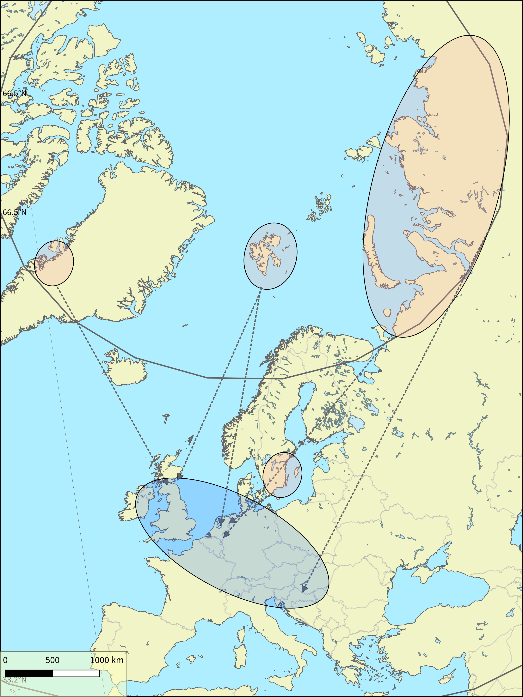

***
<small> - Mostly migratory </small>
<small> - Large increases since 1960s: conservation & crops[1] </small>

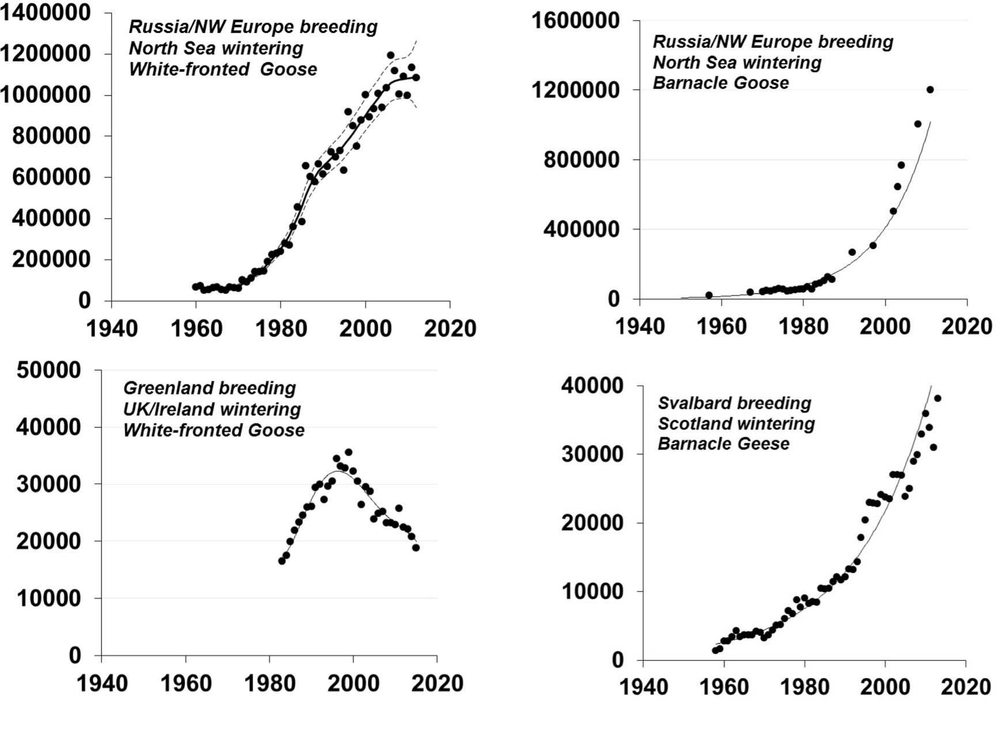

<small> 1 Fox & Madsen 2017 </small>

Geese in Europe: Challenges
===

- Conflict with agriculture^1,2
- Range expansion^1,2
- Change in migration patterns^3
- Much data, less analysis

<small>1 Fox & Madsen 2017, 2 Koffijberg et al. 2017, 3 van der Jeugd et al. 2009</small>

What is the role of families in spatio-temporal population patterns of geese wintering in the Netherlands, Belgium, and northern Germany?
===
type: sub-section

Which goose?
===

Fieldwork
===

Death by Data
===

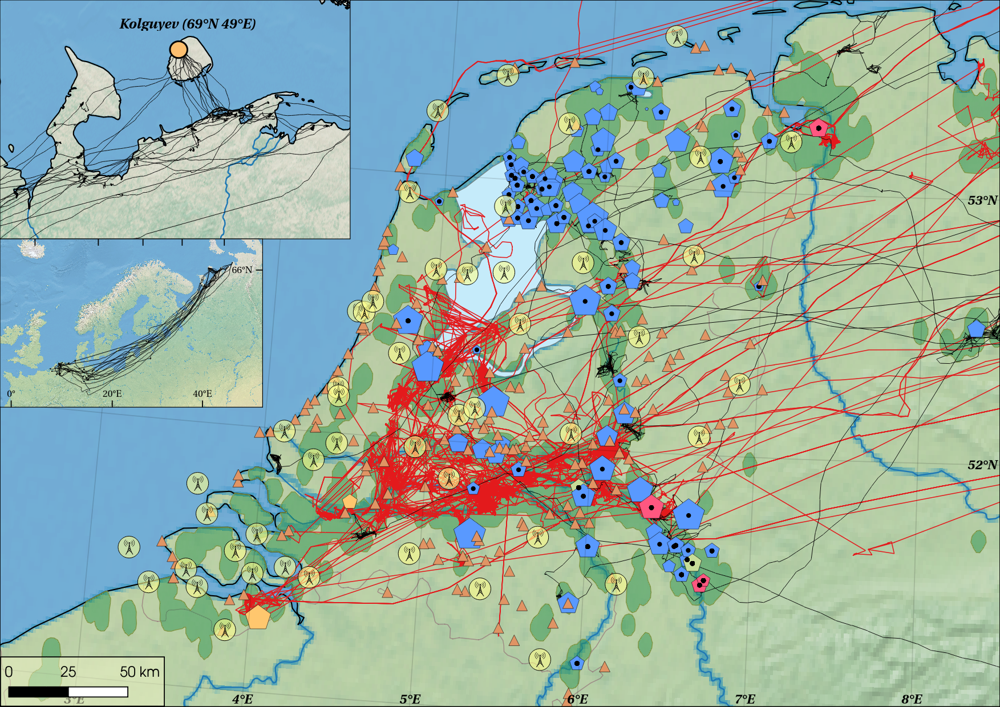

What data?
===

- Counts of observed flocks (Russia & Holland)
- Observations of neck-banded geese
- Observations of geese flying overhead
- GPS tracking of 19 individuals from Russia
- GPS tracking of 13 families (64 birds) in Holland
- Weather data from KNMI and DWD

What Did I Find?
===
type: sub-section

Flocks are made of families
===

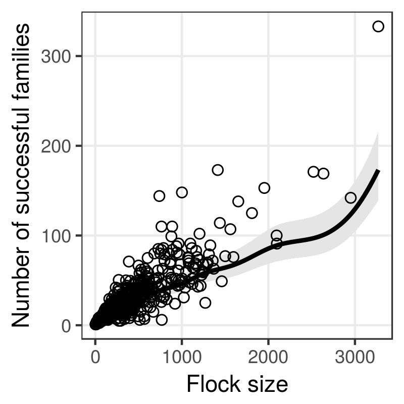

***

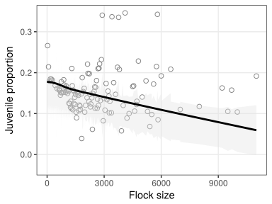

...but families prefer smaller flocks.

Families arrive and leave later
===

***

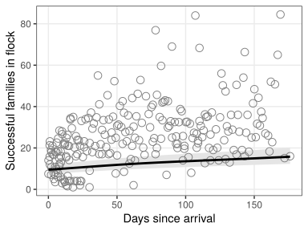

More families winter farther west
===

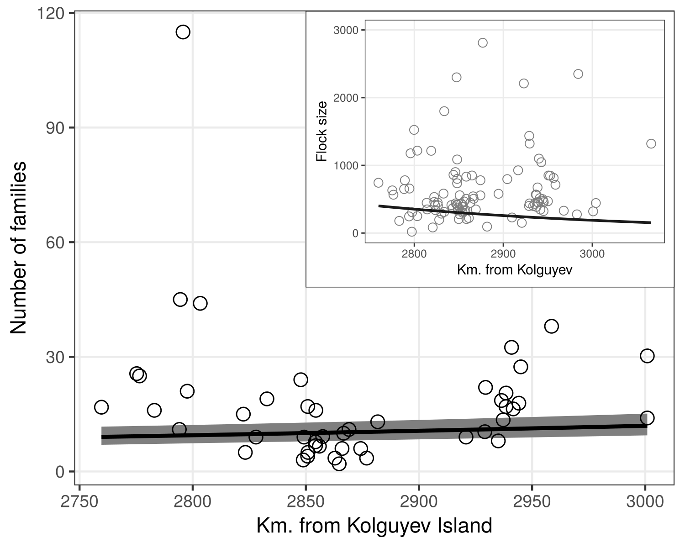

Larger families winter farther west
===

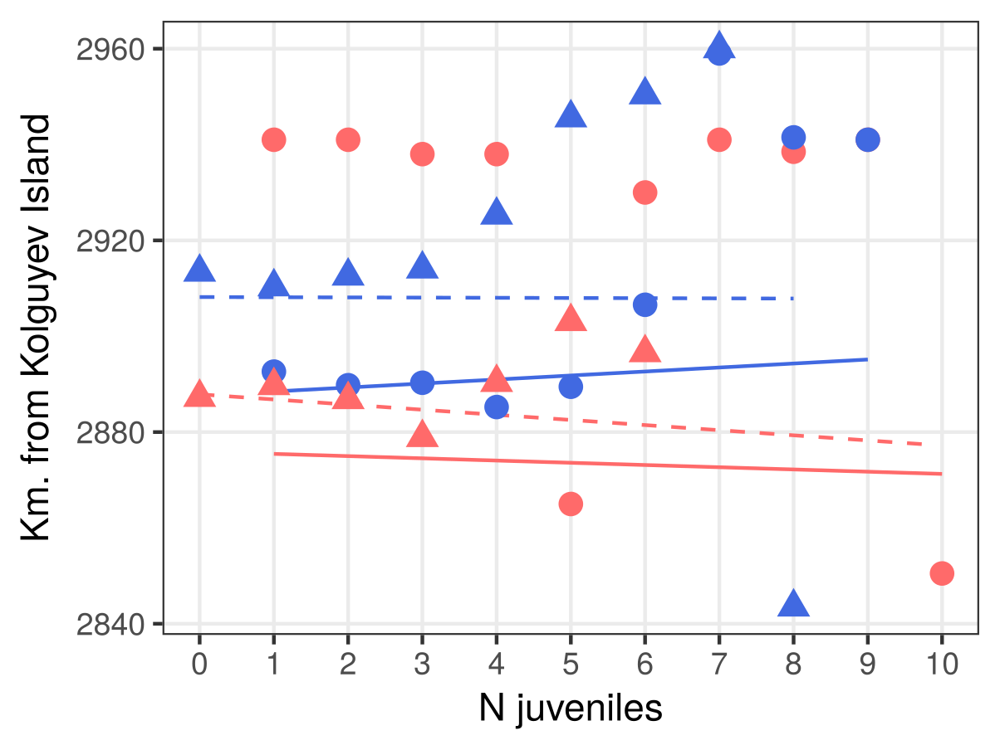

...but only later in winter.

Juveniles become independent over the winter
===

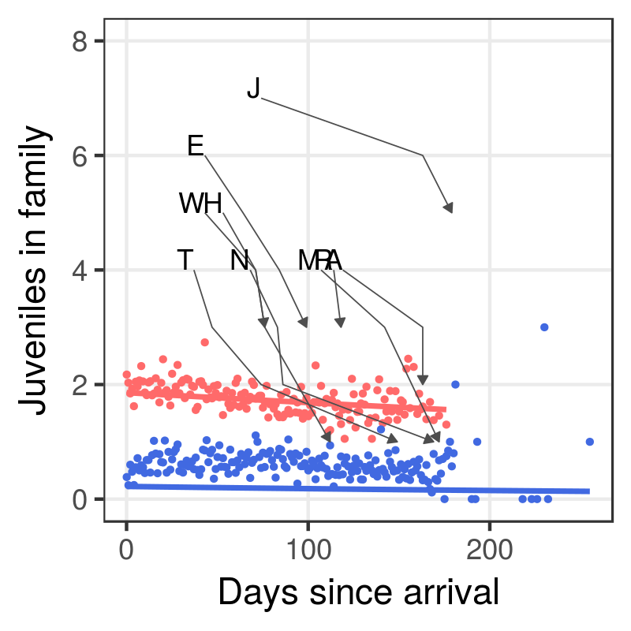

Juveniles could separate accidentally or be driven away.

Juvenile independence might be accidental
===

Families that fly more are more likely to split...

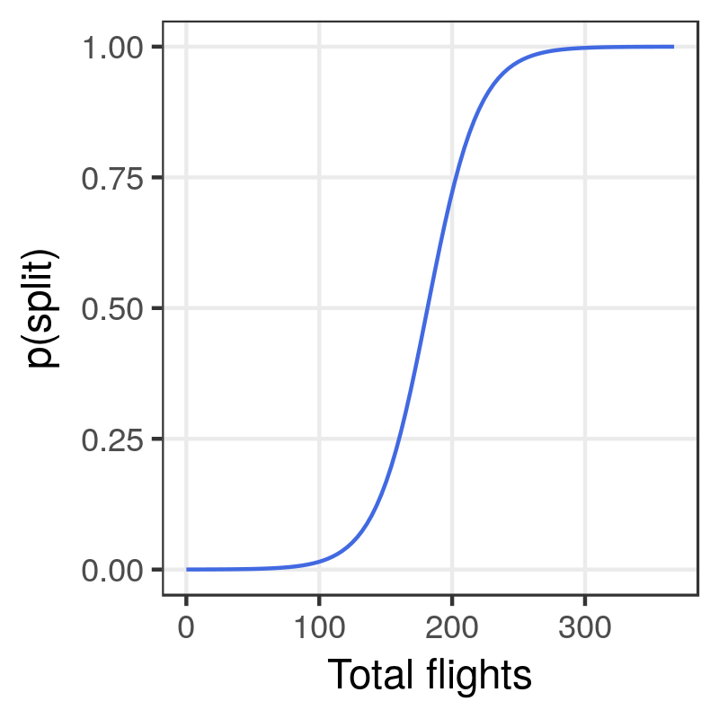

***

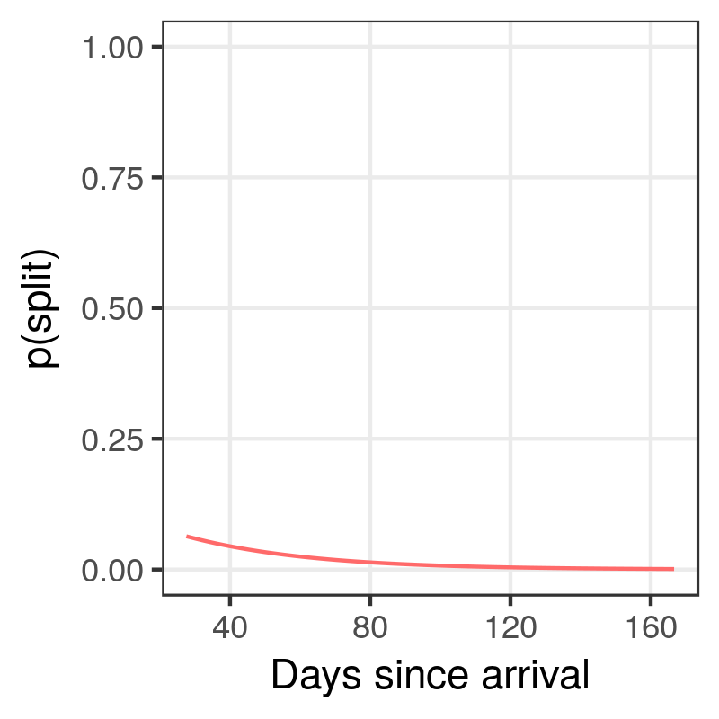

...but this happens less in late winter.

Summary
===
type: sub-section

- Wintering geese are differentially migratory
- Families & juveniles occur along a gradient in space and time
- Climate & access to forage is important
- Families lose juveniles over the winter
- Juvenile independence could be unintentional

How does this help?
===
- Different population classes can be better targeted for management
-
- Hunting families could prevent range expansion
-
- Hunting adults could reduce crop damage
-

Thanks Due
===

- **Andrea Kölzsch** (MPIO)
- **Kees Koffijberg** (SOVON)
- **Stefan Garthe** (FTZ - CAU Kiel)
- Kamran Safi (MPIO)
- Jennifer Golbol (MPIO)
- Gerhard Müskens (WUR)
- Peter Glazov (IG-RAS)

***

- **Wilhelm Windhorst** (CAU Kiel)
- Joana Alves (UC)
- Esteban Suarez (USFQ)
- Emilie Valier-Brasier (UP)
- Freddie-Jeanne Richard (UP)

Thanks for your time
===
type: sub-section

**Questions?**

**Pratik Gupte**

International Master in Applied Ecology

Christian-Albrechts-Universität zu Kiel + 
Universidade de Coimbra +
Université de Poitiers +

Department of Migration & Immuno-ecology,
Max Planck Institute for Ornithology.
