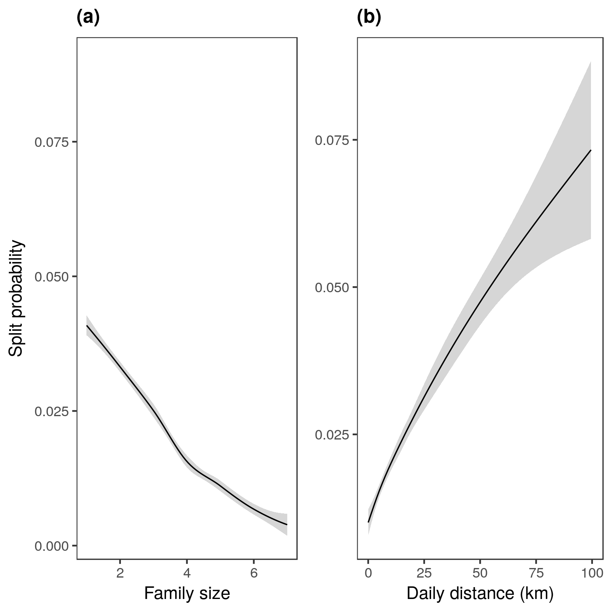

# Figures

![**Fig. 1. (a).** Wintering grounds of greater white-fronted geese _Anser a. albifrons_ in the Netherlands and northern Germany, showing 123 sites (blue pentagons) where the age-rato of 7,149 focks was determined, a subset of 65 sites (black dots) where 51,037 successful families were recornen in 1,884 focks. Shaded area bounds 10,635 ring-resightings. 21 split events (red diamonds) were observed in 13 GPS tracked families. Observations correspond well with major rivers and waterbodies, marked in blue. Data were collected from 2000 - 2017. **(b)** Breeding grounds (ellipse) in Russia with Kolguyev island (dot) and general flyway (arrow) to wintering area (rectangle) [adapted from @madsen1999goose].](fig1.png)

\pagebreak

\pagebreak

![**Fig. 3. (a).** GLMM fits (lines) and mean number of juveniles per family every 15 days since goose autumn arrival (shapes) for each dataset. Successful families in flocks (circles and solid red line), ring-resightings including unsuccessful pairs (triangles and dotted blue line), and ring-resightings with only successful pairs (squares and dashed black line). **(b)**. Number of juveniles in each family (name in box) which split, at the start of the tracking period, and following each subsequent juvenile split.](fig3.png)

\pagebreak

![**Fig. 4.** GAMM fits (solid black lines), data (circles), 95% confidence intervals for data (vertical dashed lines) and fits (shaded grey areas), and overall observed mean response value (horizontal dashed red line) for **(a)** Mean number of successful families in flocks every 5 days after autumn arrival; **(b)** Mean number of families in flocks, in increments of 50 individuals; **(c)** Mean proportion of first-winter juveniles in flocks every 5 days; **(d)** Mean juvenile proportion of flocks, in increments of 20 individuals. Means and proportions were pooled across all years. Note that in C days since arrival was modelled as a smoothed covariate using thin plate splines, and 4 knots. Conditional fits shown in (c) and (d).](fig4.png)

\pagebreak

\pagebreak

