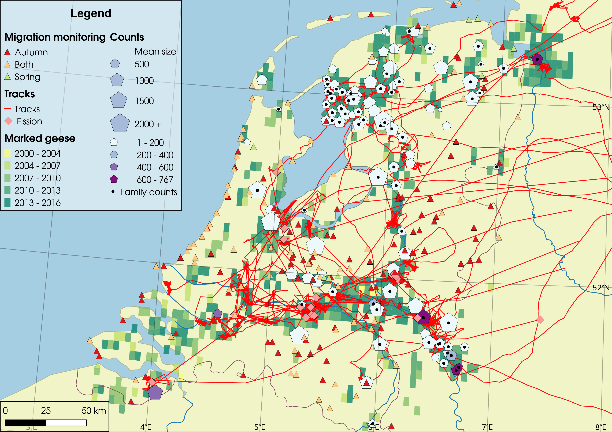
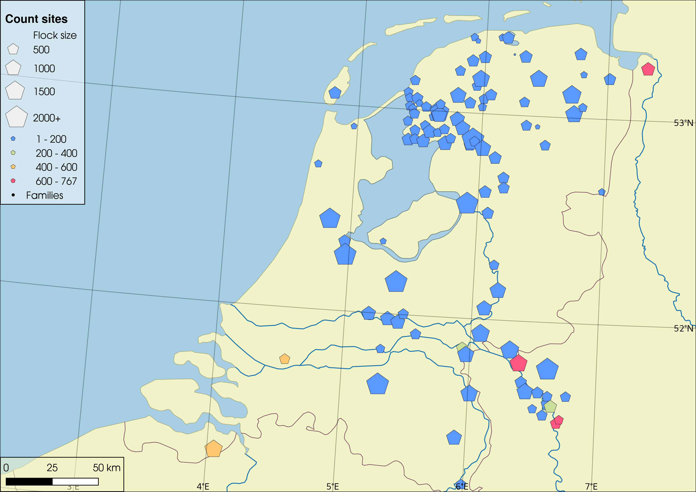
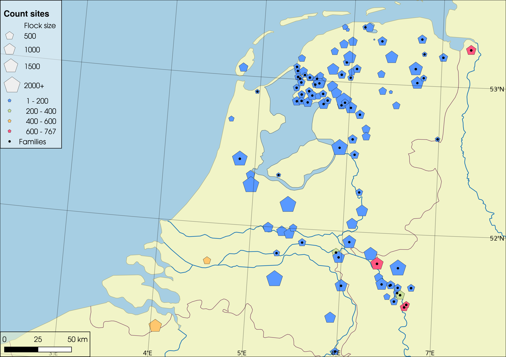
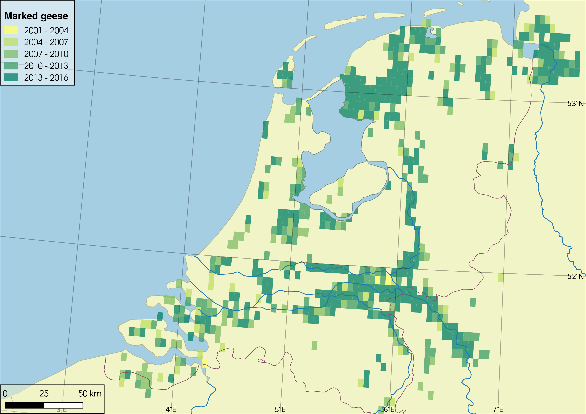
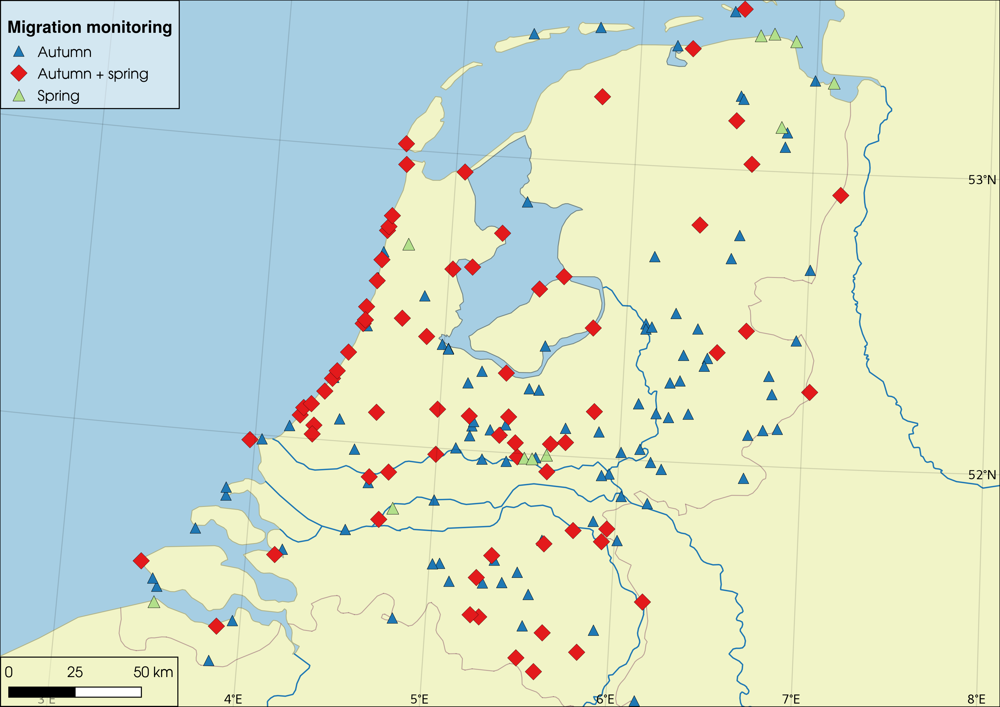
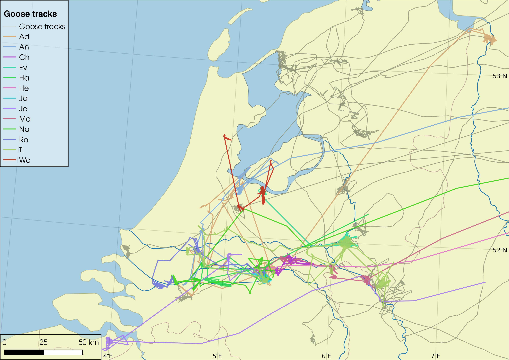

```{r setup, include=FALSE}
knitr::opts_chunk$set(echo = FALSE)
```

## Living in families is a good idea

- All the benefits of grouping ^[@krause2002living]^

- Costs shared with relatives ^[@HAMILTON19641]^

- Higher rank in groups ^[@Poisbleau20061351; @scheiber2013social]^

## Goose families are variable

- Multi-year bonds ^[@10.2307/4088245]^

- Larger *spp.* stay together longer ^[@johnson1988weak]^

- Populations may segregate in winter ^[@vangilder1985differential]^

## We want to know

- Wintering site ~ family size

- Family size ~ time, flock size ↓

- Flock size ~ distance to breeding grounds ↓

- $p(split)$ ~ flight activity ↑

## 


## 



## 



## 



##



##



##



## 


## Refs